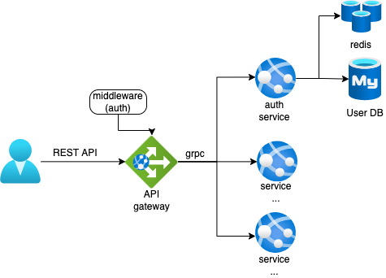

# gobackend

## commit message rule
1. **[type][packagename] message ...**  \
type
    - major: It's backward incompatible due to change of existing API.
    - minor: Introduction of New function or im
    - patch: Bug fix but is backward compatible.  
    - error: Error by just mistake.

## Architecture
